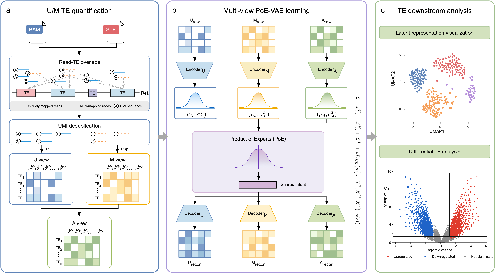

# scALTER

## Introduction
scALTER is a framework for transposable element (TE) expression reconstruction and latent representation learning in single-cells.

<div align="center">

</div>

## Installation
Follow the steps below to set up scALTER:

#### 1. Clone the Repository

Retrieve the latest version of scALTER from the GitHub repository:

```bash
git clone https://github.com/yangqi-cs/scALTER.git
cd scALTER
```

#### 2. Set Up the Conda Environment

Create and activate the conda environment:

```bash
conda env create -f env.yml
conda activate scALTER
```

## Usage
- #### scripts/scALTER.py

Run the full scALTER pipeline, including count extraction, view construction, and model training. Required inputs:

```text
--bam                  Input .bam file, or a text file listing .bam paths
--whitelist            Cell barcode whitelist file, or a matching whitelist path list
--te-annotation-gtf    TE annotation file in GTF format
```

Common options:

```text
--result-root          Root output directory. Default: /qiyang/GitHub/scALTER/results
--cell-tag             BAM tag for cell barcodes. Default: CB
--umi-tag              BAM tag for UMIs. Default: UB
--threads              Threads for count extraction. Default: 32
--count-likelihood     Count likelihood, nb or zinb. Default: nb
--n-hidden             Hidden dimension. Default: 128
--n-layers             Number of neural network layers. Default: 1
--n-latent             Latent dimension. Default: 32
--dropout-rate         Dropout rate. Default: 0.0
--kl-weight            KL loss weight. Default: 1e-5
--learning-rate        Learning rate. Default: 1e-3
--batch-size           Training batch size. Default: 128
--epochs               Maximum training epochs. Default: 300
```

- #### scripts/extract_counts.py

Extract unique and multi TE count tables from a BAM file.

- #### scripts/build_views.py

Build aligned unique, multi, and merge sparse matrix views.

- #### scripts/train_model.py

Train the scALTER model and export reconstructed means, latent representations, and checkpoints.

## Examples
Run the full pipeline:

```bash
python scripts/scALTER.py \
  --bam /path/to/alignments.bam \
  --whitelist /path/to/barcodes.tsv \
  --te-annotation-gtf /path/to/te_annotation.gtf
```

Run with commonly tuned parameters:

```bash
python scripts/scALTER.py \
  --bam /path/to/alignments.bam \
  --whitelist /path/to/barcodes.tsv \
  --te-annotation-gtf /path/to/te_annotation.gtf \
  --threads 48 \
  --count-likelihood nb \
  --epochs 300 \
  --n-layers 1 \
  --n-latent 32 \
  --batch-size 128 \
  --learning-rate 1e-3
```

For multiple BAM files, provide one text file for `--bam` and one matching text file for `--whitelist`.
Each line in the whitelist list corresponds to the BAM path on the same line:

```bash
python scripts/scALTER.py \
  --bam /path/to/bam_list.txt \
  --whitelist /path/to/whitelist_list.txt \
  --te-annotation-gtf /path/to/te_annotation.gtf
```

By default, scALTER writes results under:

```text
/qiyang/GitHub/scALTER/results/
```

Intermediate count TSV files are retained under `results/tmp/counts/` after the run.
Temporary overlap files are written under `results/tmp/bedtools/` and are removed unless `--keep-count-tmp` is used.

The main output files include:

```text
raw_exp/unique.npz
raw_exp/multi.npz
raw_exp/merge.npz
raw_exp/barcodes.tsv
raw_exp/features.tsv
raw_exp/h5ad/scalter_subfamily_u_m_aligned.h5ad
model/scalter_weights.pt
model/scalter_checkpoint.pt
recon_exp/mean_u.tsv
recon_exp/mean_m.tsv
recon_exp/mean_a.tsv
latent/latent_mu.tsv
latent/latent_std.tsv
```

## Contact
:e-mail: **Yang Qi** (yang.qi@mail.nwpu.edu.cn)

School of Computer Science, Northwestern Polytechnical University, Xi’an, Shaanxi 710072, China
